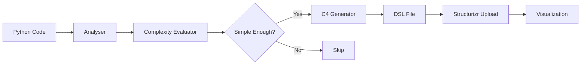

# ROAD: Rapid Onboarding Agent for Developers

## Table of Contents

- [Introduction](#introduction)
- [Features](#features)
- [Project Structure](#project-structure)
- [Installation](#installation)
- [How it works](#how-it-works)
- [Components](#components)
- [Configuration](#configuration)
- [Structurizr Setup](#structurizr-setup)
- [Example Output](#example-output)
- [Testing](#testing)
- [Customisation](#customisation)
- [Use cases](#use-cases)
- [Troubleshooting](#troubleshooting)
- [Architecture](#architecture)
- [Contributing](#contributing)
- [License](#license)

## Introduction 
Welcome to the ROAD (Rapid Onboarding Agent for Developers) repository. This project has been undertaken by a few friends who 1) wanted to learn and build an agentic system and 2) undertook a piece of discovery work indicating that understanding and onboarding onto new codebases is an extremely time consuming activity for developers. In a recent [poll](https://www.linkedin.com/feed/update/urn:li:activity:7206935161370804224/) by JetBrains, it was indicated that almost half of developers time is actually spent understanding code, rather than building new code / refactoring.

To address this, we have set out to build an agentic Python toolchain that can analyse codebases, evaluate their complexity, and automatically generate [C4 architecture diagrams](https://c4model.com/) using LLMs and Structurizr. It is designed to help developers, architects, and teams quickly understand and visualise the structure of unfamiliar codebases, accelerating onboarding and documentation.


## Features 
- **Intelligent Analysis**: Uses AST parsing to analyze Python code structure
- **Complexity Evaluation**: LLM evaluates if codebase is suitable for automated diagram generation
- **C4 Diagram Generation**: Creates complete Structurizr DSL from actual code
- **Automatic Upload**: Uploads generated diagrams to Structurizr cloud
- **Configurable**: All settings in config.yaml
- **Modular Design**: Clean, testable components

## Project Structure

```
road-agent-orchestration/
├── config.yaml # Configuration file
├── main.py     # Entry point
├── agents/
│       ├── dsl_upload_agent.py # DSL upload automation
├── cli/
│       ├── upload_dsl.py # CLI configuration for DSL upload 
├── evaluator/
│       ├── c4_generator.py # C4 DSL generator 
│       ├── codebase_analyser.py     # Analyses Python code 
│       ├── codebase_evaluator.py    # LLM evaluation logic 
│       └── workflow.py     # LangGraph orchestration
├── tests/
│       ├── run_all_tests.py
│       ├── test_c4_generator.py
│       ├── test_codebase_analyser.py
│       └── test_codebase_evaluator.py
├── structurizr_client.py # Initialise Structurizr API
└── requirements.txt # Requirements file
```

## Installation

- **Clone the repository via terminal**
    ```sh
    git clone https://github.com/lukeowen1/road-agent-orchestration.git
    cd road-agent-orchestration
    ```
- **Use the terminal to create a virtual environment called venv**
    ```sh
    python -m venv venv
    ```
- **Activate the virtual environment**
    ```sh
    source venv/bin/activate 
    ``` 
- **Install pip / check the latest version is running**
    ```sh
    python3 -m pip install --upgrade pip
    python3 -m pip --version
    ```
- **Install external packages and libraries**
    ```sh
    pip install -r requirements.txt
    ```
- **Set OpenAI_API_KEY**
    ```sh
    export OPENAI_API_KEY="sk-..."
    ```
- **Run Evaluation**
     ```sh
     python3 main.py /path/to/your/codebase
     ```

## How It Works



## Components

1. **Analysis** (`codebase_analyser.py`)
   - Parses all Python files using AST
   - Counts classes, functions, lines
   - Detects frameworks (FastAPI, Django, Flask, etc.)
   - Identifies architectural patterns

2. **Evaluator** (`codebase_evaluator.py`)
   - LLM evaluates complexity based on metrics
   - Determines if codebase is suitable for C4 generation
   - Provides confidence score and reasoning

3. **C4 Generation** (`c4_generator.py`)
   - Feeds entire codebase to LLM (if simple enough)
   - Generates complete Structurizr DSL
   - Creates System Context, Container, and Component views
   - Validates DSL syntax

4. **Upload** (`dsl_upload_agent.py / upload_dsl.py`)
   - Uploads DSL to Structurizr via API or CLI
   - Opens visualization in browser
   - Provides manual upload instructions as fallback

## Configuration
```yaml 
# LLM Settings
llm:
  model: "gpt-3.5-turbo-16k"  # or gpt-4
  temperature: 0.1
  max_tokens: 4000

# Complexity Thresholds
complexity:
  simple:
    max_files: 50
    max_lines: 5000
  moderate:
    max_files: 150
    max_lines: 20000

# Structurizr Settings (optional)
structurizr:
  api_key: "your-api-key"
  api_secret: "your-api-secret"
  workspace_id: 12345
  auto_open_browser: true

# Analysis Settings
analysis:
  skip_directories: ["venv", "__pycache__", ".git"]
  entry_point_patterns: ["main.py", "app.py"]
  max_code_samples: 3
```

## Structurizr Setup
### Option 1: Automatic Upload (API)
1. Create Structurizr account: https://structurizr.com/signup
2. Create workspace and note the ID
3. Get API credentials from workspace settings
4. Add to config.yaml:
```yaml
structurizr:
  api_key: "your-key"
  api_secret: "your-secret"
  workspace_id: 12345
```
5. Run with upload:
```bash
python main.py path/to/your/codebase/ --upload
```

### Option 2: Manual Upload (No Setup Required)
1. Generate DSL:
```bash
python main.py path/to/your/codebase/
```
2. Copy generated .dsl file content
3. Go to https://structurizr.com/dsl
4. Paste and click "Render"

### Command Line Options 
**main.py**
```bash
# Basic evaluation
python main.py ./project

# With Structurizr upload
python main.py ./project --upload

# Quiet mode (minimal output)
python main.py ./project --quiet

# Show setup help
python main.py --setup-help
```
**upload_dsl.py**
```bash
# Upload existing DSL file
python upload_dsl.py system_c4.dsl

# Validate DSL only
python upload_dsl.py system_c4.dsl --validate-only

# Show workspace URLs
python upload_dsl.py system_c4.dsl --show-urls
```

## Example Output
### Console output 
```
Evaluating: /path/to/project
============================================================

Analysis complete:
 • Files: 25
 • Lines: 2,500
 • Frameworks: FastAPI, SQLAlchemy

Evaluation:
 • Complexity: SIMPLE
 • Score: 3.5/10
 • Can Generate C4: YES

Generating C4 DSL...
C4 DSL generated successfully!
Saved to: fastapi_app_c4.dsl

Uploading to Structurizr...
Upload successful!
View at: https://structurizr.com/workspace/12345
```
### Generated DSL Example 
```dsl
workspace "FastAPI Application" {
    model {
        user = person "User" "API consumer"
        
        apiSystem = softwareSystem "FastAPI App" {
            webApi = container "Web API" "REST API" "Python/FastAPI" {
                controllers = component "Controllers" "API endpoints"
                services = component "Services" "Business logic"
                models = component "Models" "Data models"
                
                controllers -> services "Uses"
                services -> models "Uses"
            }
            database = container "Database" "PostgreSQL"
            
            webApi -> database "Reads/Writes"
        }
        
        user -> apiSystem "Makes requests to"
    }
    
    views {
        systemContext apiSystem {
            include *
            autoLayout
        }
        
        container apiSystem {
            include *
            autoLayout
        }
        
        component webApi {
            include *
            autoLayout
        }
    }
}
```

## Testing 
```bash
# Run all tests
python -m pytest

# Run specific test file
python -m pytest tests/test_analyzer.py

# Run with coverage
python -m pytest --cov=evaluator --cov-report=html
```

## Customisation

### Use Different LLM Model

Edit `config.yaml`, line 5:
```yaml
llm:
  model: "gpt-4" 
```

### Adjust Complexity Thresholds

Edit `config.yaml`, line 24:
```yaml
complexity:
  simple:
    max_files: 50
    max_lines: 5000
    description: "Single service, clear structure, standard patterns"
  moderate:
    max_files: 150
    max_lines: 20000
    description: "Few services, standard frameworks, mostly clear boundaries"
  complex:
    description: "Multiple services, many integrations, unclear boundaries"
```

### Add More Metrics

Extend `codebase_analyser.py`:
```python
# Add new metrics to _analyze_file()
if isinstance(node, ast.AsyncFunctionDef):
    result['async_functions'] += 1
```

## Use Cases
### Suitable Codebases (Simple enough for an LLM to generate C4)
**Good for:**
- Single service APIs
- Small to medium libraries
- Monolithic applications < 10k lines
- Clear architectural patterns

**Not suitable for:**
- Large microservice systems
- Highly coupled legacy code
- Multi-language projects
- 20k+ lines of code


## Troubleshooting

| Issue | Solution |
|-------|----------|
| API Key Error | Set `OPENAI_API_KEY` environment variable |
| Rate Limit | Use `gpt-4` or add delays |
| No Python Files | Check path and ensure `.py` files exist |
| JSON Parse Error | LLM response format issue, check prompt |
| Codebase too complex | Codebase exceeds thresholds, manual C4 needed |

## Architecture
The tool uses a pipeline architecture with LangGraph orchestration:
- **Analyser**: Deterministic AST-based analysis
- **Evaluator**: LLM-based complexity assessment  
- **Generator**: LLM creates DSL from codebase
- **Uploader**: Handles Structurizr integration

## Contributing

1. Fork the repository
2. Create a feature branch
3. Add tests for new functionality
4. Ensure all tests pass
5. Submit a pull request

## License
MIT
